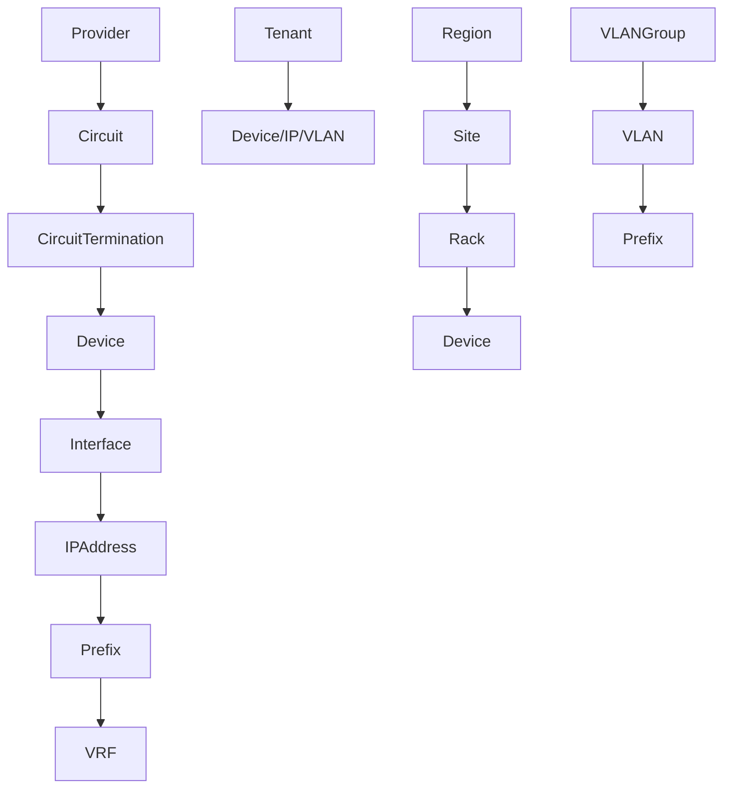
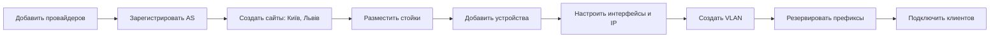

# 🌐 Полное руководство по NetBox для сетевых инженеров ISP  
**Адаптировано под украинскую инфраструктуру: Киев, Львов, Одесса, Харьков, Днепр**

> **NetBox** — это открытая система управления IP-адресами (IPAM) и центрами обработки данных (DCIM), разработанная специально для сетевых инженеров и интернет-провайдеров (ISP).  
> Это идеальный инструмент для документирования, автоматизации и централизации сетевой инфраструктуры.

📌 **Цель руководства**:  
Помочь украинским ISP эффективно внедрить NetBox — от установки и миграции данных до построения иерархии, автоматизации и интеграции.

---

## 📚 Оглавление

1. [Установка NetBox](#1-установка-netbox)
2. [Определение источников данных](#2-определение-источников-данных)
3. [Какие данные переносить в NetBox](#3-какие-данные-переносить-в-netbox)
4. [Проверка данных перед миграцией](#4-проверка-данных-перед-миграцией)
5. [Порядок импорта данных и рекомендуемая иерархия](#5-порядок-импорта-данных-и-рекомендуемая-иерархия)
6. [Зависимости моделей для ISP](#6-зависимости-моделей-для-isp)
7. [Полезные фишки для украинского ISP](#7-полезные-фишки-для-украинского-isp)
8. [Пример workflow](#8-пример-workflow-для-украинского-isp)
9. [Примечания и best practices](#9-примечания-и-best-practices)
10. [Работа с API NetBox: автоматизация для ISP](#10-работа-с-api-netbox-автоматизация-для-isp)

---

## 1. Установка NetBox

### 🔧 Способы развертывания

| Метод | Описание | Подходит для |
|------|---------|-------------|
| **Docker (рекомендуется)** | Быстрый запуск с помощью `netbox-docker` | Тест, dev, продакшн |
| **Bare-metal (Ubuntu/CentOS)** | Ручная установка на сервере | Продакшн, контроль |
| **Официальная документация** | Подробные шаги установки | Все случаи |

🔗 [Официальная документация](https://docs.netbox.dev/en/stable/)  
🔗 [NetBox Docker](https://github.com/netbox-community/netbox-docker)

### ✅ После установки

1. Откройте веб-интерфейс: `http://your-server:8000`
2. Создайте суперпользователя:
   ```bash
   python manage.py createsuperuser
   ```
3. Настройте:
   - Часовой пояс: `Europe/Kyiv`
   - Язык: `ru` или `uk`
   - Валюта: `UAH`
   - Интеграции (если используются)

---

## 2. Определение источников данных

> **"Если данные не согласованы — NetBox будет бесполезен."**

### 🔍 Где искать источники истины?

| Тип данных | Примеры |
|----------|--------|
| IP-префиксы | Excel, CSV, RIPE WHOIS |
| Клиенты | CRM (например, 1С, Bitrix24, локальная база) |
| Устройства | Конфигурации (RANCID, Oxidized), Excel |
| Физическая инфраструктура | Схемы стоек, фото, Notion |
| Подключения | Порт-таблицы, Google Sheets |

### ⚠️ Типичные проблемы

- Разные команды используют разные источники (Excel vs Google Sheets)
- Данные в "черновиках" (Notion, Telegram, Word)
- Нет согласованности по именованию (например, `Kyiv-SW1` vs `Kiev-Switch01`)
- Ручные выдачи IP без документирования

### ✅ Что делать

1. Составьте **инвентаризацию источников данных**.
2. Назначьте **ответственных** за каждый источник.
3. Определите **область применения** (например: "таблица X — источник для клиентов в Одессе").
4. Утвердите **единый источник истины** для каждой категории.

---

## 3. Какие данные переносить в NetBox

### ✅ Рекомендуемые для переноса

| Категория | Примеры для украинского ISP |
|---------|-----------------------------|
| **IPAM** | Префиксы `185.1.2.0/24` (Киев), `94.178.0.0/16` (магистраль) |
| **VLAN** | VLAN 100 — интернет, VLAN 200 — IPTV (Днепр) |
| **AS и BGP** | AS12345, пиринг с "Укртелеком", "Vega Telecom" |
| **Физика** | Коммутаторы в узлах (Львов, Харьков), стойки, кабели |
| **Клиенты** | Tenants: "ТОВ Світ", "ФОП Петренко" |
| **Цепи** | Магистральные линии: 1Gbps от "Datagroup" |

### 🛠 Расширение функциональности

- **Custom Fields** — добавьте поля: `Договір №`, `Дата підключення`, `Менеджер`
- **Плагины** — интеграция с CRM, биллингом, Zabbix

### ❌ Что не стоит переносить

| Данные | Альтернатива |
|------|-------------|
| DNS-записи | BIND, PowerDNS |
| Биллинг | 1С, ISPmanager |
| Статистика трафика | Zabbix, Cacti |
| Документы | Wiki, Notion |

> 💡 **Совет**: NetBox — это **источник истины для инфраструктуры**, а не универсальная CRM.

---

## 4. Проверка данных перед миграцией

> **Garbage In, Garbage Out (GIGO)**

### 🔍 Что проверять

- Соответствие IP-адресов префиксам (например, `185.1.2.10` входит в `185.1.2.0/24`)
- Актуальность VLAN (нет "мертвых" VLAN 999)
- Корректность подключений (нет "висячих" кабелей)
- Совпадение с реальной сетью (особенно в узлах: Киев, Львов)

### 🛠 Инструменты

- Используйте **CSV/JSON** для подготовки данных
- Напишите **скрипты валидации** (Python, Pandas)
- Настройте **правила именования** в NetBox (например: `KYIV-CORE-01`)

### ✅ Пример проверки

```python
# Проверка, что IP входит в префикс
import ipaddress
if ipaddress.IPv4Address("185.1.2.10") in ipaddress.IPv4Network("185.1.2.0/24"):
    print("OK")
```

---

## 5. Порядок импорта данных и рекомендуемая иерархия

> **Соблюдайте зависимости!** NetBox требует создания объектов в правильном порядке.

### 📌 Рекомендуемый порядок (для ISP)

| Шаг | Объект | Пример |
|-----|--------|--------|
| 1 | **Providers** | "Укртелеком", "Datagroup" |
| 2 | **ASN** | AS12345, привязан к провайдеру |
| 3 | **Regions / Sites** | "Київ", "Львів", "Одеса" |
| 4 | **Tenant Groups / Tenants** | "Юр. особи" → "ТОВ Світ" |
| 5 | **Racks / Locations** | "Rack A1", "POP1-Київ" |
| 6 | **Manufacturers / Device Types** | Mikrotik RB4011, Cisco ISR4331 |
| 7 | **Platforms / Device Roles** | RouterOS, "Клієнтський комутатор" |
| 8 | **Devices** | KYIV-SW01, ODESSA-RTR02 |
| 9 | **Interfaces** | `ether1`, `xe-0/0/0`, MAC |
| 10 | **Circuits** | 10Gbps от "Укртелеком" |
| 11 | **VRF / Route Targets** | `Customer-VRF`, `Management` |
| 12 | **VLAN Groups / VLANs** | VLAN 100 — "Internet", VLAN 200 — "IPTV" |
| 13 | **Prefixes / IP Ranges** | `185.1.2.0/24`, `203.0.113.0/24` |
| 14 | **IP Addresses** | `185.1.2.10/24`, привязан к интерфейсу |
| 15 | **Cables** | Патч-корды, оптика между устройствами |

> ✅ **Совет**: Начинайте с глобальных объектов (провайдеры, AS), затем — локальные (сайты, устройства).

---

## 6. Зависимости моделей для ISP

### 🧩 Основные связи



### 🔗 Примеры

- **Клиент**:  
  `Tenant Group "Юр. особи"` → `Tenant "ТОВ Світ"` → `Site "Харків"` → `IP 185.1.2.10`, `VLAN 100`

- **Физика**:  
  `Region "Захід"` → `Site "Львів, пл. Ринок"` → `Rack A1` → `Device "LVIV-SW01"`

- **IP**:  
  `VRF "Customer"` → `Prefix 185.1.2.0/24` → `IP 185.1.2.10` → `Interface ether5`

---

## 7. Полезные фишки для украинского ISP

| Функция | Описание | Где найти |
|-------|---------|----------|
| **BGP-сессии** | Документируйте пиринг через плагин `netbox-bgp` | Plugins → BGP |
| **Кабели** | Отслеживайте патч-корды и оптику | DCIM → Cables |
| **Инвентаризация** | SFP, RAM, модули в устройствах | DCIM → Inventory Items |
| **API** | Автоматизация через REST API | `/api/` |
| **Custom Fields** | Добавьте поля: `Договір №`, `Тариф` | Admin → Custom Fields |
| **Скрипты** | Массовый импорт VLAN, IP, устройств | Scripts → Custom |
| **Резервирование IP** | Выделяйте пулы для регионов (Киев, Днепр) | IPAM → Prefixes → "Reserve" |

> 💡 **Идея**: Напишите скрипт, который автоматически создает VLAN 100–199 для каждого нового сайта.

---

## 8. Пример workflow для украинского ISP



### Пошагово:

1. Добавьте провайдеров: `Укртелеком`, `Vega Telecom`
2. Зарегистрируйте AS: `AS12345`
3. Создайте сайты: `Київ DC1`, `Львів POP1`
4. Разместите стойки: `Rack A1-A10`
5. Добавьте устройства: `Core-Router-1`, `Access-SW-5`
6. Настройте интерфейсы: `xe-0/0/0: 203.0.113.1/30`
7. Создайте VLAN: `VLAN 100: Customers`
8. Резервируйте префиксы: `203.0.113.0/24` для клиентов Днепра

---

## 9. Примечания и best practices

### 🇺🇦 Для украинских ISP

- ✅ **Клиенты (Tenants)**: Используйте для связи клиента с IP, VLAN и портом.
- ✅ **RIPE NCC**: Документируйте префиксы, зарегистрированные в RIPE.
- ✅ **Физическая инфраструктура**: Документируйте стойки и кабели — это критично при авариях.
- ✅ **Автоматизация**: Используйте **скрипты** и **API** для массового импорта.
- ✅ **Интеграция**: Подключите NetBox к:
  - CRM (через API)
  - Биллинг (1С, ISPmanager)
  - Мониторинг (Zabbix, Grafana)

### 🔄 Рекомендуемый цикл

```text
Проверка данных → Импорт в NetBox → Валидация → Интеграция → Автоматизация
```

### 🚀 Вывод

> **NetBox — это не просто база данных, а основа для автоматизации и прозрачности вашей сети.**  
> Начните с правильной иерархии: **провайдеры → сайты → устройства → сети**.  
> Это упростит масштабирование и поддержку в условиях растущей украинской инфраструктуры.

---

## 10. Работа с API NetBox: автоматизация для ISP

> **NetBox предоставляет мощное REST API**, доступное по адресу `/api/`.  
> Это ключ к **автоматизации**, **интеграции с биллингом**, **синхронизации с CRM** и **массовому обновлению данных**.

### 🔐 Настройка доступа

1. Зайдите в NetBox → **User → API Tokens**
2. Создайте токен с правами `read` и/или `write`
3. Сохраните токен (он показывается только один раз)

### 🛠 Технические детали

- Базовый URL: `http://your-netbox/api/`
- Заголовок авторизации: `Authorization: Token <ваш_токен>`
- Формат: `JSON`
- Библиотека: `requests` (Python)

---

### 📦 Установка зависимостей (Python)

```bash
pip install requests
```

---

### ✅ Пример 1: Получение списка всех коммутаторов

```python
import requests

# Настройки
NETBOX_URL = "http://netbox.your-isp.ua/api"
TOKEN = "your-api-token-here"

# Заголовки
headers = {
    "Authorization": f"Token {TOKEN}",
    "Accept": "application/json",
    "Content-Type": "application/json",
}

# Запрос: получить все устройства с ролью "switch"
response = requests.get(
    f"{NETBOX_URL}/dcim/devices/",
    headers=headers,
    params={
        "role": "switch",  # Например, "access-switch", "distribution-switch"
        "site": "kyiv-dc1" # Опционально: фильтр по сайту
    }
)

if response.status_code == 200:
    switches = response.json()["results"]
    for switch in switches:
        print(f"Имя: {switch['name']}, Модель: {switch['device_type']['model']}, IP: {switch.get('primary_ip', {}).get('address', 'N/A')}")
else:
    print("Ошибка:", response.status_code, response.text)
```

> 🔍 Поддерживаемые фильтры: `site`, `role`, `manufacturer`, `status`, `tenant`, `tag`.

---

### 🚀 Пример 2: Массовая заливка оборудования (коммутаторов)

```python
import requests

NETBOX_URL = "http://netbox.your-isp.ua/api"
TOKEN = "your-api-token-here"

headers = {
    "Authorization": f"Token {TOKEN}",
    "Accept": "application/json",
    "Content-Type": "application/json",
}

# Список устройств для добавления
new_devices = [
    {
        "name": "LVIV-SW04",
        "device_type": {"model": "RB4011iGS+"},
        "device_role": {"name": "access-switch"},
        "site": {"name": "Львів POP1"},
        "status": "active",
        "manufacturer": {"name": "MikroTik"},
        "primary_ip4": {"address": "192.168.10.104/24"},
    },
    {
        "name": "ODESSA-SW03",
        "device_type": {"model": "DES-3526"},
        "device_role": {"name": "access-switch"},
        "site": {"name": "Одеса Центр"},
        "status": "planned",
        "manufacturer": {"name": "D-Link"},
    }
]

for device in new_devices:
    response = requests.post(f"{NETBOX_URL}/dcim/devices/", headers=headers, json=device)
    if response.status_code in [200, 201]:
        print(f"✅ Устройство {device['name']} добавлено")
    else:
        print(f"❌ Ошибка при добавлении {device['name']}: {response.status_code} — {response.text}")
```

> 💡 Подсказка: `device_type`, `device_role`, `site`, `manufacturer` должны **уже существовать** в NetBox.

---

### 🌐 Пример 3: Создание IP-префикса и IP-адреса

```python
# 1. Создаем префикс
prefix_data = {
    "prefix": "185.1.3.0/24",
    "site": {"name": "Київ DC1"},
    "description": "Клієнти, район Шевченка",
    "status": "active",
    "tenant": {"slug": "tov-svit"}  # Привязка к клиенту
}

response = requests.post(f"{NETBOX_URL}/ipam/prefixes/", headers=headers, json=prefix_data)

if response.status_code == 201:
    print("✅ Префикс 185.1.3.0/24 создан")
    prefix_id = response.json()["id"]
else:
    print("❌ Ошибка создания префикса:", response.text)

# 2. Создаем IP-адрес
ip_data = {
    "address": "185.1.3.10/24",
    "status": "active",
    "description": "Шлюз для VLAN 100",
    "assigned_object_type": "dcim.interface",
    "assigned_object_id": 123,  # ID интерфейса (можно получить отдельно)
    "tenant": {"slug": "tov-svit"}
}

response = requests.post(f"{NETBOX_URL}/ipam/ip-addresses/", headers=headers, json=ip_data)

if response.status_code == 201:
    print("✅ IP-адрес 185.1.3.10/24 добавлен")
else:
    print("❌ Ошибка добавления IP:", response.text)
```

---

### 👥 Пример 4: Создание клиента (Tenant)

```python
tenant_data = {
    "name": "ТОВ Нові Технології",
    "slug": "novi-tekhnologiyi",
    "group": {"name": "Юридичні особи"},
    "comments": "Контракт №45 від 2025-04-01",
    "custom_fields": {
        "contract_id": "ISP-2025-045",
        "manager": "Іван Петренко"
    }
}

response = requests.post(f"{NETBOX_URL}/tenancy/tenants/", headers=headers, json=tenant_data)

if response.status_code == 201:
    print("✅ Клиент 'ТОВ Нові Технології' добавлен")
else:
    print("❌ Ошибка:", response.status_code, response.text)
```

> ⚠️ Убедитесь, что `custom_fields` существуют в NetBox (Admin → Custom Fields).

---

### 🔁 Пример 5: Синхронизация с внешней системой (например, CSV)

```python
import csv
import requests

# Чтение CSV-файла с новыми свитчами
with open("new_switches.csv", mode="r", encoding="utf-8") as file:
    reader = csv.DictReader(file)
    for row in reader:
        device_data = {
            "name": row["name"],
            "device_type": {"model": row["model"]},
            "device_role": {"name": "access-switch"},
            "site": {"name": row["site"]},
            "status": "active",
            "manufacturer": {"name": row["manufacturer"]}
        }
        response = requests.post(f"{NETBOX_URL}/dcim/devices/", headers=headers, json=device_data)
        if response.status_code == 201:
            print(f"✅ Добавлен: {row['name']}")
        else:
            print(f"❌ Ошибка: {row['name']} — {response.text}")
```

**Формат CSV (`new_switches.csv`)**:
```csv
name,model,site,manufacturer
KYIV-SW10,RB4011iGS+,Київ DC1,MikroTik
DNIPRO-SW05,DES-3526,Дніпро POP1,D-Link
```

---

### 🧰 Полезные API-эндпоинты

| Описание | Эндпоинт |
|--------|----------|
| Все устройства | `/api/dcim/devices/` |
| Все IP-адреса | `/api/ipam/ip-addresses/` |
| Префиксы | `/api/ipam/prefixes/` |
| VLAN | `/api/ipam/vlans/` |
| Клиенты | `/api/tenancy/tenants/` |
| Сайты | `/api/dcim/sites/` |
| Интерфейсы | `/api/dcim/interfaces/` |
| Цепи | `/api/circuits/circuits/` |
| Поиск по имени | `/api/dcim/devices/?name=KYIV-SW01` |

> 🔍 Все эндпоинты: [https://docs.netbox.dev/en/stable/api/](https://docs.netbox.dev/en/stable/api/)

---

### 💡 Best Practices по работе с API

| Рекомендация | Описание |
|-------------|---------|
| **Используйте slug** | Вместо `name` — `slug` (например, `kyiv-dc1`) — надежнее для API |
| **Проверяйте существование объектов** | Перед созданием — убедитесь, что `site`, `role`, `tenant` уже есть |
| **Обрабатывайте ошибки** | Проверяйте `status_code` и `response.json()` |
| **Используйте токены с минимальными правами** | Разделите `read` и `write` токены |
| **Логируйте действия** | Записывайте, что было добавлено/изменено |
| **Тестируйте на dev-среде** | Не работайте с API напрямую в продакшене без тестов |

---

### 🔄 Интеграция с биллингом или CRM

Вы можете:
- При создании клиента в CRM — **автоматически создавать Tenant в NetBox**
- При подключении клиента — **резервировать IP и VLAN**
- При замене оборудования — **обновлять Device в NetBox**

> 🔄 Пример:  
> **1С → Python-скрипт → NetBox API**  
> или  
> **Bitrix24 → Webhook → NetBox**

---

✅ **Вывод**:  
API NetBox — это **основа автоматизации** для украинского ISP.  
С его помощью вы можете:
- Заливать оборудование массово
- Синхронизировать данные с биллингом
- Генерировать отчёты
- Интегрировать с мониторингом (Zabbix, Grafana)

---

> 💡 **Совет**: Храните скрипты в отдельной папке репозитория, например `/scripts/netbox-sync/`, и запускайте их по cron или через CI/CD.

---

📌 **Готовый шаблон скрипта и CSV-файлы** можно добавить в репозиторий:  
📁 `/examples/api-scripts/`  
- `create_devices.py`  
- `sync_tenants.py`  
- `import_switches.csv`  
- `env.example` (для токенов)

---

✅ Теперь ваше руководство полностью покрывает:
- Установку
- Миграцию
- Иерархию
- API и автоматизацию
- Практические примеры для Украины

---

## 📚 Полезные ссылки

- [Официальная документация NetBox](https://docs.netbox.dev/en/stable/)
- [NetBox Docker](https://github.com/netbox-community/netbox-docker)
- [Device Type Library — официальная библиотека моделей оборудования](https://github.com/netbox-community/devicetype-library)
- [REST API NetBox](https://docs.netbox.dev/en/stable/api/)
- [GitHub проекта NetBox](https://github.com/netbox-community/netbox)

---

*Документ обновлён: 2025-04-05*  
*Автор: Сетевой инженер ISP, Украина*  
*Лицензия: MIT*
